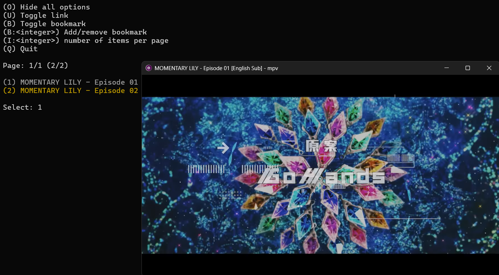

# AniYT

[](https://github.com/CleveTok3125/AniYT/blob/main/LICENSE)
[](https://github.com/CleveTok3125/AniYT/releases)
[](https://github.com/CleveTok3125/AniYT/security/code-scanning)
[](https://github.com/CleveTok3125/AniYT/actions/workflows/ci.yml)
[](https://github.com/CleveTok3125/AniYT/actions/workflows/build.yml)

A feauture rich cli tool to browse and watch videos in YouTube playlists. Specially designed for watching anime on YouTube.

# Demo ([v0.13.0rc3](https://github.com/CleveTok3125/AniYT/releases/tag/v0.13.0rc3))


# Key Features

1. **Update Playlist from YouTube Channel**\
   Update playlists from a YouTube channel using its URL, ID, or Handle. Support updating and combining playlists from multiple sources, similar to package manager.

2. **Browse Playlists and Videos**\
   Browse through playlists and videos in the saved playlists with pagination for easier navigation.

3. **Search Playlists**\
   Search for playlists by keyword.

4. **History Tracking**\
   Continue watching previously viewed videos through the watch history and history tracking.

5. **Bookmarking**\
   Bookmark favorite videos or playlists.

6. **Play Videos with MPV**\
   Play videos using the MPV player (supports both Android and auto modes).

7. **View Thumbnail**\
   View thumbnails with MPV player

8. **Download Videos with SponsorBlock**\
   Download videos and automatically skip sponsors using SponsorBlock.

9. **Automatically check for yt-dlp updates**\
   Only check Python dependency, MPV Player if not using this dependency needs to be updated manually.

10. **Playlist update notification**\
   Notify when there is a new video in the watched playlist.

To see the full features, see [cli_help.txt](https://github.com/CleveTok3125/AniYT/blob/artifacts/artifacts/help/cli_help.txt)

# Dependencies
- Python >= 3.10 (recommended >= 3.13)
- _Go >= 1.22 (recommended >= 1.25.1)_*
- MPV or MPV-X11
- YT-DLP

*_Only needed when building from source_

# Supported OS/Arch (Pre-built Binaries)

|          OS         	| x86_64 	| notes 	| arm64/aarch64 	|                       notes                      	|
|:-------------------:	|:------:	|:-----:	|:-------------:	|:------------------------------------------------:	|
| Windows             	|    ✅   	|   -   	|       ✅       	|                         -                        	|
| macOS               	|    ✅   	|   -   	|       ✅       	|                         -                        	|
| Linux               	|    ✅   	| glibc 	|       ✅       	|                       glibc                      	|
| Android<br>(Termux) 	|    ⚠️   	|   -   	|       🟡       	| bionic libc<br>toolchain not fully supported yet 	|

* ✅: Full support
* 🟡: Partial support - some features may not work
* ⚠️: No official support (may require intervention)
* ❌: Not supported

The sdist still supports most OS/Arch

# Installation
## Install from GitHub Releases (recommended)
```bash
curl -fsSL https://clevetok3125.github.io/AniYT/install.py | python -
```
## Install from Source (rolling)
```bash
pip install git+https://github.com/CleveTok3125/AniYT.git
```
## Install from Github PyPI
```bash
pip install --index-url https://clevetok3125.github.io/AniYT/ --extra-index-url https://pypi.org/simple aniyt
```

# Usage
## Use with CLI Directly
```bash
ani-yt -h
ani-tracker -h
```
## Example
```bash
ani-yt -c MuseAsia   # Update/Create new list of playlists from specified channel
ani-yt -l   # List all available playlists
ani-yt search "Attack on Titan"  # Search and return matching playlists
ani-tracker --working-dir "./data" --interval 1h   # Watch new videos every 1 hour based on data generated from `ani-yt`
```

# Uninstall
```bash
python -m pip uninstall AniYT
```

# Install and run locally
## Clone repo
```bash
git clone https://github.com/CleveTok3125/AniYT/
cd AniYT
```
## Setup environment
```bash
python -m venv venv
source venv/bin/activate
```
## Install requirements
```bash
pip install -r requirements.txt
pip install setuptools cython
```
## Compile Cython
```bash
python setup.py build_ext --inplace
```
## Build Go binary
```bash
cd src/ani_tracker
go build -o ../../bin/ani-tracker .
cd ../../
```
## Build
```bash
pip install .
```
## Run live for debugging
### ani-yt 
```bash
PYTHONPATH=src python -m ani_yt.ani_yt -h
```
### ani-tracker
```bash
cd src/ani_tracker
go run . -d ./../../data --no-daemon -h
cd ../../
```

# About additional/generated files
- `./AniYT/mpv-config/custom.conf`: like `mpv.conf`. Use if you want to separate it from the original MPV configuration.
- `./AniYT/data/playlists.json`: stores playlist information.\
Mainly to reduce repeated calls to YT-DLP API which slows down retrieval significantly when the channel has many playlists.
- `./AniYT/data/history.json`: store viewing history.
- `./AniYT/data/bookmark.json`: store bookmark.
- `./AniYT/data/channel_sources.txt`: list of channel sources.
- `./AniYT/mpv-scripts/gestures.lua`: Recommended if running in graphical session via termux-x11. [Details](https://github.com/CleveTok3125/AniYT-mpv-gestures)
- `./AniYT/mpv-scripts/sponsorblock_minimal.lua`: Use SponsorBlock to skip sponsorships. Similar to `gesture.lua`, it is only loaded automatically if in a graphical session via termux-x11.
- `./AniYT/data/playlists.diff`: File containing difference information after running `ani-tracker`
- `./AniYT/data/*.log`: Log files for debugging
- `./AniYT/data/*.lock`: This is a file created when the program runs. Delete it to terminate the program.

*If using python modules, these files are automatically generated in the working directory. `custom.conf` is not automatically generated, however it can be manually created in the working directory to use it.*

# Additional options
## SponsorBlock
- Use SponsorBlock plugin for MPV to skip OP/EN

## Ani-Tracker: Notify new videos in playlist
- This feature is separated from the original project and named `ani-tracker`
- Instructions are included in `ani-yt --full-help`
- The binary is included in the wheel of the original project, and can be run directly on the CLI. See [Usage](#usage)
- Can be run via the `tracker` subcommand of `ani-yt` as a wrapper.\
   For example `ani-yt tracker --help` will print help for `ani-tracker`

## Android
- For Android, use MPV with youtube-dl built-in. Refer to [this link](https://github.com/mpv-android/mpv-android/pull/58)\
   In addition, you can use MPV on [Termux-x11](https://github.com/termux/termux-x11). Refer [this setup instructions](https://github.com/termux/termux-x11?tab=readme-ov-file#Setup-instructions).
- In `--mpv-player termux-x11` mode, `gestures.lua` script will be loaded by default if present to provide mouse/touch gestures. See [setup instructions](https://github.com/CleveTok3125/AniYT-mpv-gestures?tab=readme-ov-file#setup-instructions) for usage. This mode will select monitor 1 by default and send the mpv run command through it instead of having to use the command line in the graphical session. **Requires `mpv-x`**\
   Need to run termux-x11 in the background in a separate termux session. If using `xfce4`, use (one of) [these commands](https://github.com/termux/termux-x11?tab=readme-ov-file#running-graphical-applications) to launch
   ```bash
   termux-x11 :1 -xstartup "dbus-launch --exit-with-session xfce4-session"
   ```
   or for convenience:
   ```bash
   bash ./AniYT/tools/tmux-x11-start ani-yt --mpv-player termux-x11 -h
   ```

# Non-project-related notification
_This notification is for the anime fan community, not related to this project._

Currently, channels that provide free high-quality copyrighted anime on YouTube such as MuseAsia are removing some old anime and moving them to other platforms (usually paid platforms). You can refer to alternative solutions such as [ani-cli](https://github.com/pystardust/ani-cli) or [AnimeVsub](https://github.com/anime-vsub) for Vietsub (no dub yet).
